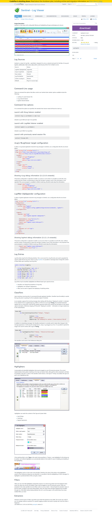

# Sentinel
 Sentinel is a great tool to watch logs in real time.
 
 It is hosted in CodePlex (https://sentinel.codeplex.com/), but it has been announced that CodePlex is going to close in the future.
 
 As I use it regularly, and the developer hasn't expressed it's migration plans I decided to make a fork of the project in GitHub to preserve it for the future.

 The code is included as-is, the only change is that the ClickOnce installer is disabled to allow it to compile (the original developer signing key is required otherwise). All attributions must go to the creator of Sentinel: yarseyah (https://www.codeplex.com/site/users/view/yarseyah).

 **Original site screenshot**
 

